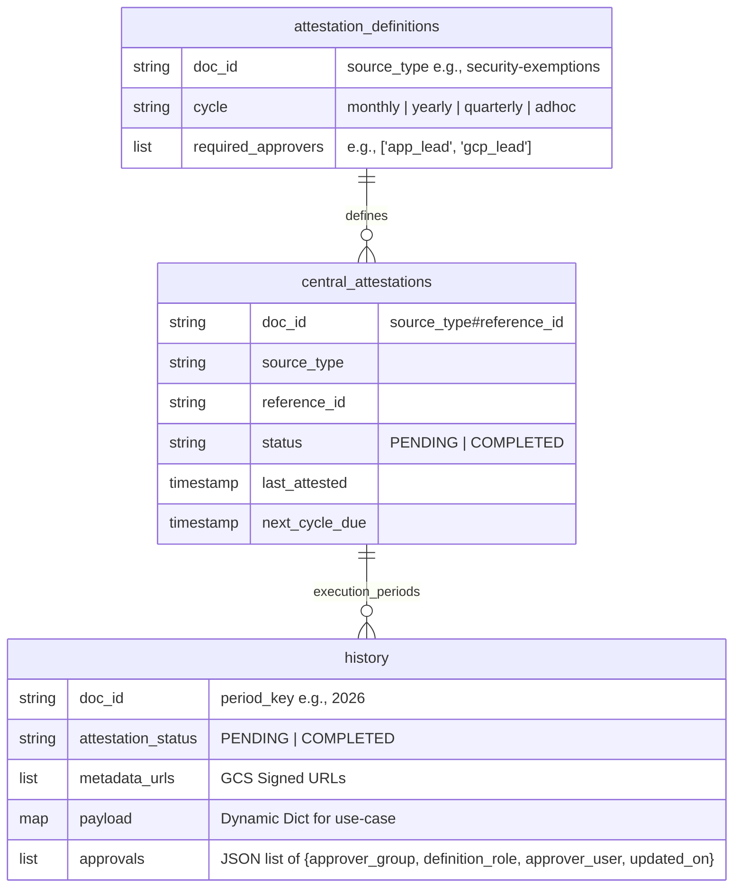

# FastAPI Attestation Service

A Python FastAPI service with a Google Cloud Firestore backend to manage multi-tenant, periodic Attestations.
The system supports dynamic payloads, multi-party approvals, and a centralized list of image evidence stored securely in Google Cloud Storage (GCS).

## Architecture & Schema (Governance-to-Execution Model)

## Engineering Constraints & Safeguards Implemented

### 1. Atomicity & Concurrency Control
- **Firestore Transactions:** The multi-party approval logic validates the incoming approval payload in a strictly isolated **Firestore Transaction**.
- **No-Upsert Guarantee:** Within the transaction footprint, the service actively parses the `approvals` array to ensure a specific user cannot submit multiple redundant approvals for the exact same group. This guards against data duplication and unintentional upserts.
- **ArrayUnion Updates:** Image evidence URL additions (`metadata_urls`) use atomic `ArrayUnion` operations so that simultaneous uploads by multiple clients never overwrite each other.

### 2. State Syncing
- Once all unique `definition_role` entries from the approvals match the `required_approvers` prescribed in the Definitions schema, the transaction atomically transitions the Execution state (`attestation_status`) to `COMPLETED`. This decouples the actual Azure/GCP Group (`approver_group`) from the required definition block (`definition_role`), allowing frontends to dynamically translate roles to explicit groups.
- The parent (`central_attestations`) status, `last_attested`, and structurally calculated `next_cycle_due` (monthly/quarterly/yearly base calculation) are dynamically updated within the very same transaction.

### 3. Strict Validation & Security
- Leverages `Pydantic` for stringent input/output validation handling.
- Validates the existence of the `source_type` within `attestation_definitions` prior to honoring any requests or database writes, preventing orphaned documents.

## API Endpoints Overview

1. `POST /api/v1/attestations/{source_type}/{reference_id}/tasks`
   - **Purpose**: Initialize a new history task period strictly defining its `mandatory_attestators`. Can be automatically invoked by cron triggers.
   
2. `POST /api/v1/attestations/{source_type}/{reference_id}/{period_key}/evidence`
   - **Purpose**: Upload physical evidence files, directly push to GCS, and bind the accessible Signed URL to the history document.

3. `POST /api/v1/attestations/{source_type}/{reference_id}/{period_key}/attest`
   - **Purpose**: Registers attestations transactionally in the execution history and evaluates completion state natively against the period's requirement blueprint.
